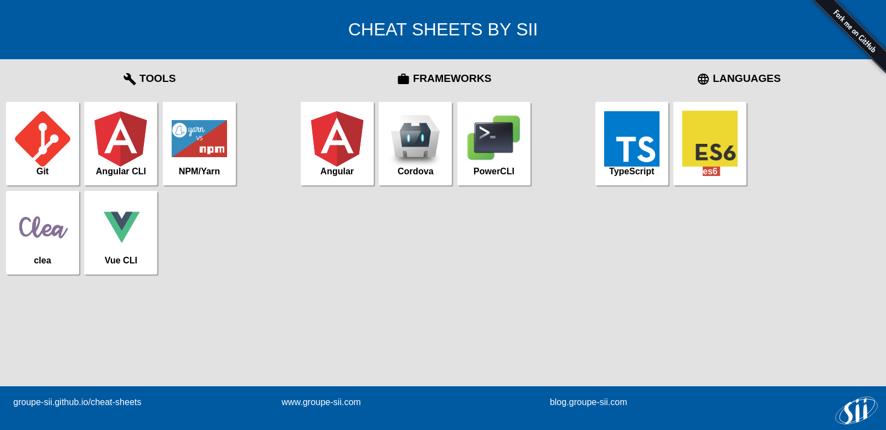
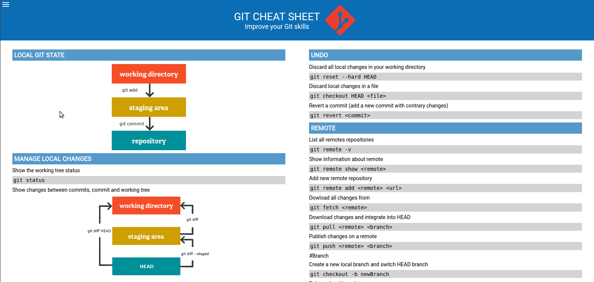
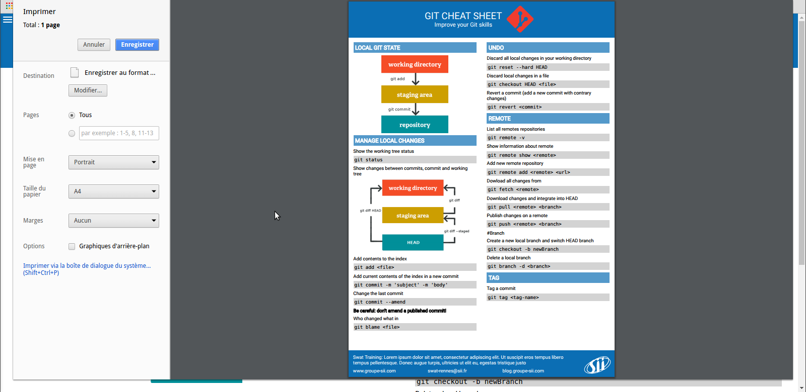

# Cheat Sheet Generator

## Hosted on github pages

Cheat sheets are hosted on github pages : [https://groupe-sii.github.io/cheat-sheets/](https://groupe-sii.github.io/cheat-sheets/)

## Browsers support <sub><sup><sub><sub>made by <a href="https://godban.github.io">godban</a></sub></sub></sup></sub>

| [](http://godban.github.io/browsers-support-badges/)</br>Chrome |
| --------- |
| last 2 versions

## Install
gulp is needed in global in order to run compilation :

`npm  install gulp -g`


`yarn`
or
`npm install`

`yarn` or `npm install`

## Usage

`gulp create-new-cheat-sheet --name <name> --category <tools|frameworks|languages>`

Put your svg|png logo in assets/images folder
Put your commands or codes on:
 - src/\<name\>/first-side/column1.md
 - src/\<name\>/first-side/column2.md
 - src/\<name\>/reverse/column1.md
 - src/\<name\>/reverse/column2.md

## Devtools

Build and reload server:

`gulp watch`

## Docker

To simplify the installation we also provide a Dockerfile to run the application in a container.

Build image:  
`docker build -t cheatsheet .`

Build image w/ proxy:  
`docker build -t cheatsheet --build-arg http_proxy=<proxy> --build-arg https_proxy=<proxy> .`

Add cheatsheet:  
```
docker run \
-v $PWD:/app \
cheatsheet:latest gulp create-new-cheat-sheet --name <name> --category <tools|frameworks|languages>
```

`-v $PWD:/app` mounts the current directory as working directory inside the container.

Put your svg|png logo in assets/images folder  
Put your commands or codes on:
 - src/\<name\>/first-side/column1.md
 - src/\<name\>/first-side/column2.md
 - src/\<name\>/reverse/column1.md
 - src/\<name\>/reverse/column2.md

Run the web server to display all the cheat-sheets:
```
docker run -ti \
-v $PWD:/app \
-p 8080:8080 \
cheatsheet:latest
```

## Print

- Hit `Ctrl+P` to generate the PDF version, using `Save as PDF`
- Disable margins

## Screenshots






